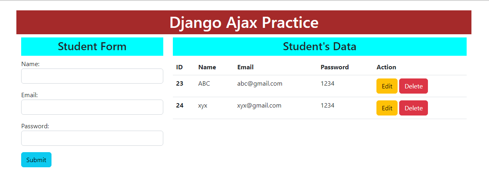
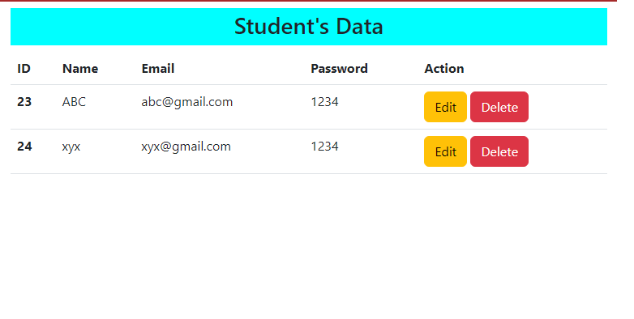

# CRUD Operation in Django using Ajax

This is the CRUD Operation of [Django](https://www.djangoproject.com/) using [JQuery](https://jquery.com/) Ajax. Adds data dynamically into database using Django views without page loading.

* [Bootstrap](https://getbootstrap.com/docs/5.2/) 5.2
* Simple Desing 
* Bootstrap Grid System
* Django Static Files are used 
* [SQL Lite3](https://www.sqlite.org/index.html) Database (Default Database of [Django](https://www.djangoproject.com/))
* [JS](https://cdnjs.com/) and [JQuery](https://jquery.com/) 3.6.1 is used

## Functionality 

This website has two parts on home page:
> left part contains form which includes Name, Email and Password which are connected to [SQL Lite3](https://www.sqlite.org/index.html) Database [Django](https://www.djangoproject.com/) 
> the second is right side contains [Bootstrap](https://getbootstrap.com/docs/5.2/) Table which displays all record and contains Action like Edit and Delete.

You can Edit or Delete your record with just one click.
To Change record click on Edit button then corresponding record would rendered in exact form without page reloading then you can save it.
To Delete record click of Delete button then corresponding record would delete without page reloading.

## Screenshots:

### Home Page:
This shows us how our home page looks like

### Form Part:
This shows us how left side of page looks like

### Table Part:
This shows us how right side of page looks like

### Edit Part:
After clicking on Edit page corresponding data rendered in form,that's how it shows

## How to run on your computer?

* Download it from [github](https://github.com/)
* Install Virtual Environment in your laptop through this command using `pip`,
    `pip install virtualenv`
* Give virtualenv name of your own desire using 
    `virtualenv name_of_your_virtual_environment`
* Activate that Virtual Environment using `name_of_your_virtual_environment\scripts\activate`
* Install Django in that Virtual Environment after activating using `pip install django` 
* Copy `Django_Ajax_CRUD` in folder in which you added Virtual Environment
* Move in that folder manually or by using command prompt
* Run `Django_Ajax_CRUD` using `python manage.py runserver`
